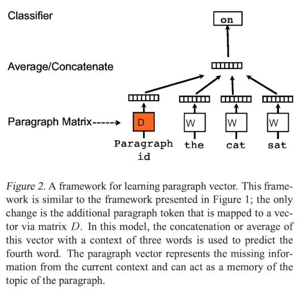
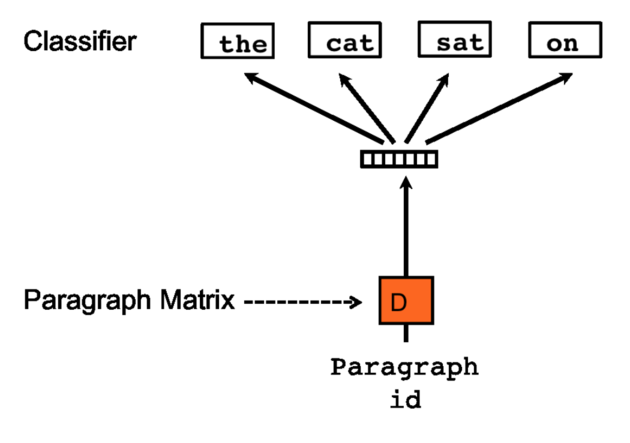

# Doc2Vec JAX

This is a JAX-based implementation of Le and Mikolov's [Doc2Vec algorithm](https://arxiv.org/abs/1405.4053), which 
builds on Word2Vec to generate document-level (bag of words) representations.

The paper proposes 2 main model variants -- Paragraph Vector-Distributed Memory (`PV-DM`) and Distributed Bag of Words (`DBOW`) -- although found `PV-DM` was more performant in most situations.

**PV-DM architecture:**



**DBOW architecture:**



## Codebase

- `doc2vec` contains the core implementation, including code to prepare documents for training
- `experiments` contains key experiments described in the original paper, reimplemented here

## Installation

### Via Docker

Pre-requisite: ensure [nvidia-docker](https://github.com/NVIDIA/nvidia-docker) is installed

```shell
$ sudo docker build -t doc2vec-jax .
$ sudo docker run --gpus all -it -v ~/doc2vec:/doc2vec doc2vec-jax:latest /bin/bash
$ poetry shell
$ python -m doc2vec.train ...
```

## TODO

- [x] `PVDM` model variant
- [x] `DBOW` model variant
- [x] Negative sampling
- [x] Sub-sampling
- [ ] Parallelise training data generation