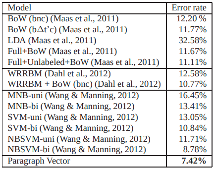

# Experiment overview

Section 3.2 of the Doc2Vec paper describes "Beyond One Sentence: Sentiment Analysis with
IMDB dataset", where paragraph vectors are trained to represent an IMDB review, and used as input to classify whether a review was positive or negative.

This method was shown to out-perform other approaches:



Here we seek to replicate their reported results, blending additional insights from the [Gensim reimplementation](https://radimrehurek.com/gensim/auto_examples/howtos/run_doc2vec_imdb.html) and discussion on the [word2vec-toolkit mailing list](https://groups.google.com/g/word2vec-toolkit/c/Q49FIrNOQRo/m/J6KG8mUj45sJ). First we'll train a Doc2Vec model to produce paragraph vectors for these reviews (training), and we'll then train a classifier to predict sentiment (evaluation).

## 1. Doc2Vec training

- Training data comes from IMDB's `unsupervised` and `training` example sets (75k total). 
- `window_size = 10` and `embedding_size = 100` (the paper reports `400`, but the Gensim reimplementation argues that does little to help performance, while blowing up memory requirements).
- `vocab_size=250_000`. This is informed by Gensim's use of a minimum word frequency count. When `2`, that yielded `265,408` unique tokens in their vocabulary.
- `context_mode=average`, which averages the context embeddings used to predict our target word during training. This saves a great deal of memory with no apparent impact on performance
- `training_epochs=10`

All told, the training run is generated by:

```bash
python -m doc2vec.generate_training_data \
--training_data_dir $HOME/Documents/doc2vec-jax/experiments/imdb_sentiment/data \
--dataset_name imdb_sentiment_vector_training \
--window_size 8 \
--vocab_size 100_000

python -m doc2vec.train \
--training_data_dir $HOME/Documents/doc2vec-jax/experiments/imdb_sentiment/data \
--model_dir $HOME/Documents/doc2vec-jax/experiments/imdb_sentiment/models \
--dataset_name imdb_sentiment_vector_training \
--window_size 8 \
--vocab_size 100_000 \
--batch_size 32 \
--context_mode average \
--embedding_size 100 \
--training_epochs 10 \
--wandb_project doc2vec-imdb-sentiment
```

NOTE: you may face GPU memory issues (I did!) relating to [JAX's pre-allocation behaviour](https://jax.readthedocs.io/en/latest/gpu_memory_allocation.html#gpu-memory-allocation). If you have issues, consider over-riding defaults with eg `export XLA_PYTHON_CLIENT_PREALLOCATE=false`.

Open questions:

- Critical to use negative sampling?
- No sub-sampling based on frequent words?
- Need to concat output of both types of models?
- Gensim uses 2-sided window -- we use 1-sided for now
- Preserve punctuation as words? Currently strip it

## 2. Classifier training